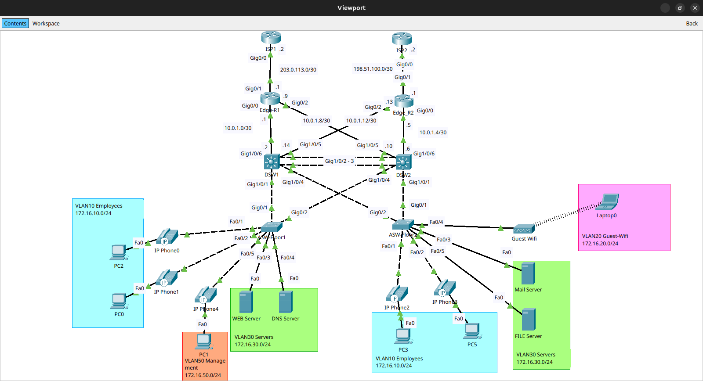
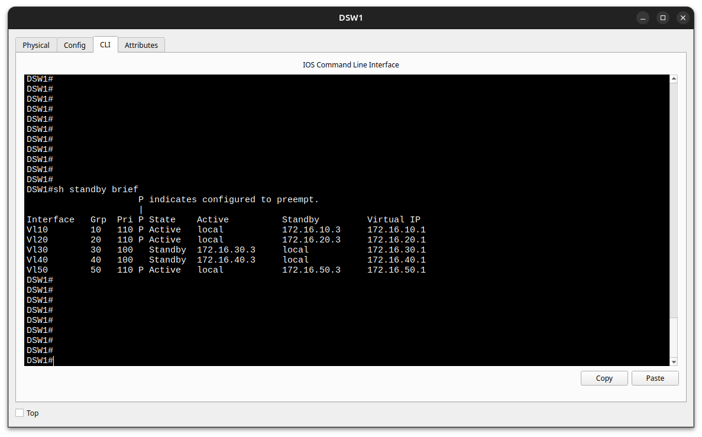

# Small Business Network with Redundancy
---

## Project Overview

This project implements a highly available network infrastructure for a small business with 50-100 employees. The design features redundant links, dual ISPs, HSRP for gateway redundancy, EtherChannel for link aggregation, and a guest wireless network with proper isolation.

**Key Learning Objectives:**
- HSRP (Hot Standby Router Protocol) configuration
- EtherChannel/Port-Channel configuration
- Spanning Tree Protocol optimization
- Wireless LAN Controller concepts
- Dual ISP failover
- NAT/PAT configuration
- VPN site-to-site tunneling

---

## Network Topology


---

## IP Addressing Scheme

### Internal Networks
| VLAN | Purpose | Network | HSRP VIP | Primary | Secondary |
|------|---------|---------|----------|---------|-----------|
| 10 | Employees | 172.16.10.0/24 | 172.16.10.1 | 172.16.10.2 | 172.16.10.3 |
| 20 | Guest WiFi | 172.16.20.0/24 | 172.16.20.1 | 172.16.20.2 | 172.16.20.3 |
| 30 | Servers | 172.16.30.0/24 | 172.16.30.1 | 172.16.30.2 | 172.16.30.3 |
| 40 | VoIP | 172.16.40.0/24 | 172.16.40.1 | 172.16.40.2 | 172.16.40.3 |
| 50 | Management | 172.16.50.0/24 | 172.16.50.1 | 172.16.50.2 | 172.16.50.3 |
| 99 | Native | unused | unused | unused | unused |

### WAN Links
- ISP 1 to Edge-R1: 203.0.113.0/30 (Public IP: 203.0.113.1)
- ISP 2 to Edge-R2: 198.51.100.0/30 (Public IP: 198.51.100.1)
- Edge-R1 to Distribution 1: 10.0.1.0/30
- Edge-R2 to Distribution 2: 10.0.1.4/30
- Edge-R1 to Distribution 2: 10.0.1.8/30
- Edge-R2 to Distribution 1: 10.0.1.12/30

### Static IP Assignments
- Web Server: 172.16.30.10
- File Server: 172.16.30.11
- Email Server: 172.16.30.12
- DNS Server: 172.16.30.13

---

## Configuration Guide

### 1. Distribution Switch 1 

```cisco
enable
configure terminal
hostname DSW1
no ip domain-lookup
enable algorithm-type scrypt secret cisco123

! Create VLANs
vlan 10
  name Employees
vlan 20
  name Guest-WiFi
vlan 30
  name Servers
vlan 40
  name VoIP
vlan 50
  name Management
vlan 99
  name Native
exit

! Configure EtherChannel to DSW2 (LACP)
interface range GigabitEthernet1/0/2 - 3
  description EtherChannel to DSW2
  channel-group 1 mode active
  no shutdown
exit

interface Port-channel1
  description EtherChannel to DSW2
  switchport mode trunk
  switchport trunk native vlan 99
  switchport trunk allowed vlan 10,20,30,40,50
exit

! Configure Link to Edge Routers
interface GigabitEthernet1/0/6
 description Link to Edge-R1
 no switchport
 ip address 10.0.1.2 255.255.255.252
 duplex auto
 speed auto
exit

interface GigabitEthernet1/0/5
 description Link to Edge-R2
 no switchport
 ip address 10.0.1.14 255.255.255.252
 duplex auto
 speed auto
exit

! Configure trunks to access switches
interface GigabitEthernet1/0/1
 description Trunk to ASW-Floor1
 switchport trunk native vlan 99
 switchport trunk allowed vlan 10,20,30,40,50
 switchport mode trunk
exit

interface GigabitEthernet1/0/4
 description Trunk to ASW-Floor2
 switchport trunk native vlan 99
 switchport trunk allowed vlan 10,20,30,40,50
 switchport mode trunk
exit

! Spanning Tree Configuration
spanning-tree mode rapid-pvst
spanning-tree vlan 10,20,50 root primary
spanning-tree vlan 30,40 root secondary

! Configure SVI for VLANs with HSRP
interface Vlan10
 description SVI Vlan 10 Employees
 ip address 172.16.10.2 255.255.255.0
 standby version 2
 standby 10 ip 172.16.10.1
 standby 10 priority 110
 standby 10 preempt
 no shutdown
exit

interface Vlan20
 description SVI Vlan 20 Guest_WiFi
 ip address 172.16.20.2 255.255.255.0
 standby version 2
 standby 20 ip 172.16.20.1
 standby 20 priority 110
 standby 20 preempt
 no shutdown
exit

interface Vlan30
 description SVI Vlan 30 Servers
 ip address 172.16.30.2 255.255.255.0
 standby version 2
 standby 30 ip 172.16.30.1
 no shutdown
exit

interface Vlan40
 description SVI Vlan 40 VoIP
 ip address 172.16.40.2 255.255.255.0
 standby version 2
 standby 40 ip 172.16.40.1
 no shutdown
exit

interface Vlan50
 description SVI Vlan 50 Management
 ip address 172.16.50.2 255.255.255.0
 standby version 2
 standby 50 ip 172.16.50.1
 standby 50 priority 110
 standby 50 preempt
 no shutdown
exit

! Enable IP routing
ip routing

! Default route to Edge Routers (tracked for failover)
ip route 0.0.0.0 0.0.0.0 10.0.1.1 
ip route 0.0.0.0 0.0.0.0 10.0.1.13 10

! DHCP Configuration
ip dhcp excluded-address 172.16.10.1 172.16.10.9
ip dhcp excluded-address 172.16.20.1 172.16.20.9
ip dhcp excluded-address 172.16.40.1 172.16.40.9

ip dhcp pool Employees
 network 172.16.10.0 255.255.255.0
 default-router 172.16.10.1
 domain-name lgemprojectccna.com
 exit

ip dhcp pool Guest_WiFi
 network 172.16.20.0 255.255.255.0
 default-router 172.16.20.1
 domain-name lgemprojectccna.com
 exit

ip dhcp pool VoIP
 network 172.16.40.0 255.255.255.0
 default-router 172.16.40.1
 domain-name lgemprojectccna.com
 exit

!Guest wifi Isolation ACL
ip access-list extended GUEST_ISOLATION
 deny ip 172.16.20.0 0.0.0.255 172.16.10.0 0.0.0.255
 deny ip 172.16.20.0 0.0.0.255 172.16.30.0 0.0.0.255
 deny ip 172.16.20.0 0.0.0.255 172.16.40.0 0.0.0.255
 deny ip 172.16.20.0 0.0.0.255 172.16.50.0 0.0.0.255
 permit ip any any

interface vlan 20
 ip access-group GUEST_ISOLATION in

!Limit remote management to Management VLAN Only 
ip access-list extended MGMT-ONLY
 permit tcp 172.16.50.0 0.0.0.255 any

line vty 0 15
 access-class MGMT-ONLY in

!OSPF configuration

interface Loopback0
 description RID-DSW1
 ip address 3.3.3.3 255.255.255.255
 ip ospf 1 area 0

router ospf 1
network 10.0.1.0 0.0.0.3 area 0
network 10.0.1.12 0.0.0.3 area 0
network 172.16.10.0 0.0.0.255 area 0
network 172.16.20.0 0.0.0.255 area 0
network 172.16.30.0 0.0.0.255 area 0
network 172.16.40.0 0.0.0.255 area 0
network 172.16.50.0 0.0.0.255 area 0
passive-interface l0
passive-interface g1/0/1
passive-interface g1/0/4
passive-interface vlan 10
passive-interface vlan 20
passive-interface vlan 30
passive-interface vlan 40
passive-interface vlan 50
int l0
ip ospf 1 area 0


!SSH Configuration 
ip domain name lgemprojectccna.com
crypto key generate rsa
1024
ip ssh version 2
line vty 0 15
transport input ssh
login local
logging synchronous

end
write memory
```

### 2. Distribution Switch 2 

```cisco
enable
configure terminal
hostname DSW2
no ip domain-lookup
enable algorithm-type scrypt secret cisco123

! Create VLANs (same as DSW1)
vlan 10
  name Employees
vlan 20
  name Guest-WiFi
vlan 30
  name Servers
vlan 40
  name VoIP
vlan 50
  name Management
vlan 99
  name Native
exit

! Configure EtherChannel to DSW1
interface range GigabitEthernet1/0/2 - 3
  description EtherChannel to DSW1
  channel-group 1 mode active
  no shutdown
exit

interface Port-channel1
  description EtherChannel to DSW1
  switchport mode trunk
  switchport trunk native vlan 99
  switchport trunk allowed vlan 10,20,30,40,50
exit

! Configure Link to Edge Routers
interface GigabitEthernet1/0/5
 description Link to Edge-R1
 no switchport
 ip address 10.0.1.10 255.255.255.252
 duplex auto
 speed auto
!
interface GigabitEthernet1/0/6
 description Link to Edge-R2
 no switchport
 ip address 10.0.1.6 255.255.255.252
 duplex auto
 speed auto

! Configure trunks to access switches
interface GigabitEthernet1/0/4
 description Trunk to ASW-Floor1
 switchport trunk native vlan 99
 switchport trunk allowed vlan 10,20,30,40,50
 switchport mode trunk

interface GigabitEthernet1/0/1
 description Trunk to ASW-Floor2
 switchport trunk native vlan 99
 switchport trunk allowed vlan 10,20,30,40,50
 switchport mode trunk

! Spanning Tree Configuration
spanning-tree mode rapid-pvst
spanning-tree vlan 30,40 root primary
spanning-tree vlan 10,20,50 root secondary

! Configure SVI for VLANs with HSRP
interface Vlan10
 description SVI Vlan 10 Employees
 ip address 172.16.10.3 255.255.255.0
 standby version 2
 standby 10 ip 172.16.10.1
!
interface Vlan20
 description SVI Vlan 20 Guest_WiFi
 ip address 172.16.20.3 255.255.255.0
 standby version 2
 standby 20 ip 172.16.20.1
!
interface Vlan30
 description SVI Vlan 30 Servers
 ip address 172.16.30.3 255.255.255.0
 standby version 2
 standby 30 ip 172.16.30.1
 standby 30 priority 110
 standby 30 preempt
!
interface Vlan40
 description SVI Vlan 40 VoIP
 ip address 172.16.40.3 255.255.255.0
 standby version 2
 standby 40 ip 172.16.40.1
 standby 40 priority 110
 standby 40 preempt
!
interface Vlan50
 description SVI Vlan 50 Management
 ip address 172.16.50.3 255.255.255.0
 standby version 2
 standby 50 ip 172.16.50.1
exit

! Enable IP routing
ip routing

! Default route to Edge Routers (tracked for failover)
ip route 0.0.0.0 0.0.0.0 10.0.1.9 
ip route 0.0.0.0 0.0.0.0 10.0.1.5 10

!Guest wifi Isolation ACL
ip access-list extended GUEST_ISOLATION
 deny ip 172.16.20.0 0.0.0.255 172.16.10.0 0.0.0.255
 deny ip 172.16.20.0 0.0.0.255 172.16.30.0 0.0.0.255
 deny ip 172.16.20.0 0.0.0.255 172.16.40.0 0.0.0.255
 deny ip 172.16.20.0 0.0.0.255 172.16.50.0 0.0.0.255
 permit ip any any

interface vlan 20
 ip access-group GUEST_ISOLATION in

!Limit remote management to Management VLAN Only 
ip access-list extended MGMT-ONLY
 permit tcp 172.16.50.0 0.0.0.255 any

line vty 0 15
 access-class MGMT-ONLY in

!OSPF configuration 

interface Loopback0
 description RID-DSW2
 ip address 4.4.4.4 255.255.255.255
 ip ospf 1 area 0

router ospf 1
 log-adjacency-changes
 passive-interface GigabitEthernet1/0/1
 passive-interface GigabitEthernet1/0/4
 passive-interface Loopback0
 passive-interface Vlan10
 passive-interface Vlan20
 passive-interface Vlan30
 passive-interface Vlan40
 passive-interface Vlan50
 network 10.0.1.8 0.0.0.3 area 0
 network 10.0.1.4 0.0.0.3 area 0
 network 172.16.10.0 0.0.0.255 area 0
 network 172.16.20.0 0.0.0.255 area 0
 network 172.16.30.0 0.0.0.255 area 0
 network 172.16.40.0 0.0.0.255 area 0
 network 172.16.50.0 0.0.0.255 area 0

int l0
ip ospf 1 area 0

!SSH Configuration 
ip domain name lgemprojectccna.com
crypto key generate rsa
1024
ip ssh version 2
line vty 0 15
transport input ssh
login local
logging synchronous

end
write memory
```

### 3. Edge Router 1 (Primary ISP) - NAT & Firewall

```cisco
enable
configure terminal
hostname Edge-R1
no ip domain-lookup
enable secret cisco123

username lgem secret cisco123

! Loopback interface
interface Loopback0
 description RID-EdgeR1
 ip address 1.1.1.1 255.255.255.255
 ip ospf 1 area 0 

! WAN Interface to ISP 1
interface GigabitEthernet0/1
  description WAN to ISP1
  ip address 203.0.113.1 255.255.255.252
  ip nat outside
  ip access-group EDGE-INBOUND in
  no shutdown
exit

! LAN Interface to Distribution switches
interface GigabitEthernet0/0
  description LAN to DSW1
  ip address 10.0.1.1 255.255.255.252
  ip nat inside
  no shutdown

interface GigabitEthernet0/2
 description LAN to DSW2
 ip address 10.0.1.9 255.255.255.252
 ip nat inside
 duplex auto
 speed auto
exit

! NAT Configuration (PAT)
access-list 1 remark PAT access-list
access-list 1 permit 172.16.10.0 0.0.0.255
access-list 1 permit 172.16.20.0 0.0.0.255
access-list 1 permit 172.16.30.0 0.0.0.255
access-list 1 permit 172.16.50.0 0.0.0.255
ip nat inside source list 1 interface GigabitEthernet0/1 overload

! Static NAT for servers (Port Forwarding)
ip nat inside source static tcp 172.16.30.10 80 203.0.113.1 80
ip nat inside source static tcp 172.16.30.10 443 203.0.113.1 443
ip nat inside source static tcp 172.16.30.12 25 203.0.113.1 25

! Access Control List (Basic Firewall)
ip access-list extended OUTSIDE-IN
  permit tcp any host 203.0.113.1 eq 80
  permit tcp any host 203.0.113.1 eq 443
  permit tcp any host 203.0.113.1 eq 25
  permit icmp any any echo-reply
  permit tcp any any established
  deny ip any any log
exit

interface GigabitEthernet0/1
  ip access-group OUTSIDE-IN in
exit

! Default route to ISP
ip route 0.0.0.0 0.0.0.0 203.0.113.2

! OSPF configuration
router ospf 1
 log-adjacency-changes
 passive-interface GigabitEthernet0/1
 passive-interface Loopback0
 network 10.0.1.0 0.0.0.3 area 0
 network 10.0.1.8 0.0.0.3 area 0
 network 203.0.113.0 0.0.0.3 area 0

! SSH configuration

ip access-list extended MGMT-ONLY
 permit tcp 172.16.50.0 0.0.0.255 any

ip ssh version 2
ip domain-name lgemprojectccna.com

line vty 0 4
 access-class MGMT-ONLY in
 logging synchronous
 login local
 transport input ssh
line vty 5 15
 access-class MGMT-ONLY in
 logging synchronous
 login local
 transport input ssh

! Basic Firewall ACLs
ip access-list extended EDGE-INBOUND
 deny ip 10.0.0.0 0.255.255.255 any
 deny ip 172.16.0.0 0.15.255.255 any
 deny ip 192.168.0.0 0.0.255.255 any
 deny ip 127.0.0.0 0.255.255.255 any
 deny ip 0.0.0.0 0.255.255.255 any
 deny ip 224.0.0.0 31.255.255.255 any
 deny ip host 255.255.255.255 any
 permit ip any any

ip access-list extended OUTSIDE-IN
  permit tcp any host 203.0.113.1 eq 80
  permit tcp any host 203.0.113.1 eq 443
  permit tcp any host 203.0.113.1 eq 25
  permit icmp any any echo-reply
  permit tcp any any established
  deny ip any any
end
write memory
```

### 4. Edge Router 2 (Backup ISP) - Similar Configuration

```cisco
enable
configure terminal
hostname Edge-R2
no ip domain-lookup
enable secret cisco123

! Loopback interface
interface Loopback0
 description RID-EdgeR2
 ip address 2.2.2.2 255.255.255.255
 ip ospf 1 area 0

! WAN Interface to ISP 2
interface GigabitEthernet0/1
  description WAN to ISP2
  ip address 198.51.100.1 255.255.255.252
  ip nat outside
  ip access-group EDGE-INBOUND in
  no shutdown
exit

! LAN Interface to Distribution switches
interface GigabitEthernet0/0
  description LAN to DSW2
  ip address 10.0.1.5 255.255.255.252
  ip nat inside
  no shutdown

interface GigabitEthernet0/2
 description LAN to DSW1
 ip address 10.0.1.13 255.255.255.252
 ip nat inside
 no shutdown
exit

! NAT Configuration
access-list 1 permit 172.16.10.0 0.0.0.255
access-list 1 permit 172.16.20.0 0.0.0.255
access-list 1 permit 172.16.30.0 0.0.0.255
access-list 1 permit 172.16.50.0 0.0.0.255

ip nat inside source list 1 interface GigabitEthernet0/1 overload

! Default route to ISP 
ip route 0.0.0.0 0.0.0.0 198.51.100.2

! SSH configuration

ip access-list extended MGMT-ONLY
 permit tcp 172.16.50.0 0.0.0.255 any

ip ssh version 2
ip domain-name lgemprojectccna.com

line vty 0 4
 access-class MGMT-ONLY in
 logging synchronous
 login local
 transport input ssh
line vty 5 15
 access-class MGMT-ONLY in
 logging synchronous
 login local
 transport input ssh

end
write memory
```

### 5. Access Switch Configuration 

#### 5.1 ASW-Floor1

```cisco
enable
configure terminal
hostname ASW-Floor1
no ip domain-lookup
enable secret cisco123

username lgem secret cisco123

!Spanning Tree configuration
spanning-tree mode rapid-pvst
spanning-tree portfast default
spanning-tree portfast bpduguard default

! VLANs
vlan 10
  name Employees
vlan 20
  name Guest_WiFi
vlan 30
  name Servers
vlan 40
  name VoIP
vlan 50
  name Management
vlan 99 
  name Native
exit

! Trunk to Distribution
interface GigabitEthernet0/1
 description Trunk to DSW1
 switchport trunk native vlan 99
 switchport trunk allowed vlan 10,20,30,40,50
 switchport mode trunk
exit

interface GigabitEthernet0/2
 description Trunk to DSW2
 switchport trunk native vlan 99
 switchport trunk allowed vlan 10,20,30,40,50
 switchport mode trunk

! Employee Access Ports with Voice VLAN
interface range f0/1 - 2
 description Employee workstation
 switchport access vlan 10
 switchport mode access
 switchport voice vlan 40
 spanning-tree portfast
 spanning-tree bpduguard enable
exit

! Servers interfaces
interface FastEthernet0/3
 description Web Server
 switchport access vlan 30
 switchport mode access
 switchport port-security
 switchport port-security violation restrict 
 spanning-tree portfast
 spanning-tree bpduguard enable
!
interface FastEthernet0/4
 description DNS Server
 switchport access vlan 30
 switchport mode access
 switchport port-security
 switchport port-security violation restrict 
 spanning-tree portfast
 spanning-tree bpduguard enable

!Management Workstations
interface FastEthernet0/5
 description Management workstation
 switchport access vlan 50
 switchport mode access
 switchport voice vlan 40
 spanning-tree portfast
 spanning-tree bpduguard enable

! Port Security
interface range FastEthernet0/1 - 2 , f0/5
  switchport port-security
  switchport port-security maximum 3
  switchport port-security violation restrict
  switchport port-security mac-address sticky
exit

! Management Interface
interface vlan 50
 description MGMT
 ip address 172.16.50.99 255.255.255.0
 no shutdown
exit

! Shutting down unused interfaces
interface range f0/6 - 24
 shutdown

ip default-gateway 172.16.50.1

!Remote management SSH
ip ssh version 2
ip domain-name lgemprojectccna.com

ip access-list extended MGMT-ONLY
 permit tcp 172.16.50.0 0.0.0.255 any
line con 0
 password cisco123
 logging synchronous
 login
!
line vty 0 4
 access-class MGMT-ONLY in
 logging synchronous
 login local
 transport input ssh
line vty 5 15
 access-class MGMT-ONLY in
 logging synchronous
 login local
 transport input ssh

end
write memory
```
#### 5.2 ASW-Floor2

```cisco
enable
configure terminal
hostname ASW-Floor1
no ip domain-lookup
enable secret cisco123

username lgem secret cisco123

!Spanning Tree configuration
spanning-tree mode rapid-pvst
spanning-tree portfast default
spanning-tree portfast bpduguard default

! VLANs
vlan 10
  name Employees
vlan 20
  name Guest_WiFi
vlan 30
  name Servers
vlan 40
  name VoIP
vlan 50
  name Management
vlan 99 
  name Native
exit

! Trunk to Distribution
interface GigabitEthernet0/1
 description Trunk to DSW2
 switchport trunk native vlan 99
 switchport trunk allowed vlan 10,20,30,40,50
 switchport mode trunk
exit

interface GigabitEthernet0/2
 description Trunk to DSW1
 switchport trunk native vlan 99
 switchport trunk allowed vlan 10,20,30,40,50
 switchport mode trunk

! Employee Access Ports with Voice VLAN
interface range f0/1 - 2
 description Employee workstation
 switchport access vlan 10
 switchport mode access
 switchport voice vlan 40
 spanning-tree portfast
 spanning-tree bpduguard enable
exit

! Servers interfaces
interface FastEthernet0/3
 description Mail Server
 switchport access vlan 30
 switchport mode access
 switchport port-security
 switchport port-security violation restrict 
 spanning-tree portfast
 spanning-tree bpduguard enable
!
interface FastEthernet0/4
 description Guest Wifi AP
 switchport access vlan 20
 switchport mode access
 switchport port-security
 switchport port-security maximum 128
 switchport port-security violation restrict 
 spanning-tree portfast

! Port Security
interface range FastEthernet0/1 - 2
  switchport port-security
  switchport port-security maximum 3
  switchport port-security violation restrict
  switchport port-security mac-address sticky
exit

! Management Interface
interface vlan 50
 description MGMT
 ip address 172.16.50.98 255.255.255.0
 no shutdown
exit

! Shutting down unused interfaces
interface range f0/6 - 24
 shutdown

ip default-gateway 172.16.50.1

!Remote management SSH
ip ssh version 2
ip domain-name lgemprojectccna.com

ip access-list extended MGMT-ONLY
 permit tcp 172.16.50.0 0.0.0.255 any
line con 0
 password cisco123
 logging synchronous
 login
!
line vty 0 15
 access-class MGMT-ONLY in
 logging synchronous
 login local
 transport input ssh

end
write memory
```

### 6. Guest WiFi Isolation ACL (Distribution Switches)

```cisco
! Prevent Guest WiFi from accessing internal networks
ip access-list extended GUEST-ISOLATION
  deny ip 172.16.20.0 0.0.0.255 172.16.10.0 0.0.0.255
  deny ip 172.16.20.0 0.0.0.255 172.16.30.0 0.0.0.255
  deny ip 172.16.20.0 0.0.0.255 172.16.40.0 0.0.0.255
  deny ip 172.16.20.0 0.0.0.255 172.16.50.0 0.0.0.255
  permit ip 172.16.20.0 0.0.0.255 any
exit

interface vlan 20
  ip access-group GUEST-ISOLATION in
exit
```

---

## Redundancy Features

### 1. HSRP (Gateway Redundancy)
- DSW1: Priority 110 (Active) for vlan 10,20, and 50
- DSW2: Priority 110 (Active) for vlan 30, and 40
- Preemption enabled for automatic failback

### 2. EtherChannel (Link Aggregation)
- 2x 1Gbps links = 2Gbps aggregate bandwidth
- LACP protocol for dynamic negotiation
- Load balancing across links

### 3. Dual ISP (WAN Redundancy)
- Primary ISP via Edge-R1
- Backup ISP via Edge-R2 (higher metric)
- Automatic failover using floating static routes

### 4. Spanning Tree
- Rapid PVST+ for fast convergence
- DSW1 as root bridge for vlan 10,20,and 50
- DSW2 as root bridge for vlan 30, and 40 for load balancing
- PortFast and BPDU Guard on access ports

---

## Testing & Verification

### HSRP Verification
```cisco
show standby brief
show standby vlan 10

! Expected output: DSW1 should be "Active" for VLANs 10,20 and 50
!                  DSW2 should be "Active" for VLANs 30, and 40
```



### EtherChannel Verification
```cisco
show etherchannel summary
show etherchannel port-channel

! Expected output: Po1 should show (SU) - Layer2 in-use
```

### NAT Verification
```cisco
show ip nat translations
show ip nat statistics

! Test from inside: ping 8.8.8.8
! Verify translation appears
```

### Failover Testing
```cisco
! Test HSRP failover
interface vlan 10
  shutdown
! Check if DSW2 becomes active

! Test ISP failover
! Shutdown Edge-R1 GigabitEthernet0/0
! Verify traffic flows through Edge-R2

! Test EtherChannel
! Shutdown one link in Port-channel1
! Verify traffic continues on remaining link
```

---

## Security Features Implemented

1. **Guest Network Isolation** - ACLs prevent guest access to internal resources
2. **Port Security** - Prevents MAC flooding and unauthorized devices
3. **BPDU Guard** - Protects against rogue switches
4. **NAT/PAT** - Hides internal IP addressing
5. **Basic Firewall ACLs** - Controls inbound traffic from Internet
6. **Management VLAN** - Separate network for device management
7. **Voice VLAN** - QoS priority for VoIP traffic

---

## High Availability Summary

| Component | Primary | Backup | Failover Time |
|-----------|---------|--------|---------------|
| Gateway | DSW1 (HSRP) | DSW2 | < 3 seconds |
| Internet | Edge-R1 (ISP1) | Edge-R2 (ISP2) | < 30 seconds |
| Distribution Links | EtherChannel | Single link | Instant |
| Spanning Tree | DSW1 (Root) | DSW2 | < 6 seconds |

---

## Future Enhancements

- Implement VPN for remote workers
- Add wireless LAN controller
- Implement QoS policies for VoIP
- Add network monitoring (SNMP)
- Implement AAA with RADIUS
- Add IPS/IDS integration

---

**Created by:** LOIC ELOMBAT  
**Date:** February 2026  
